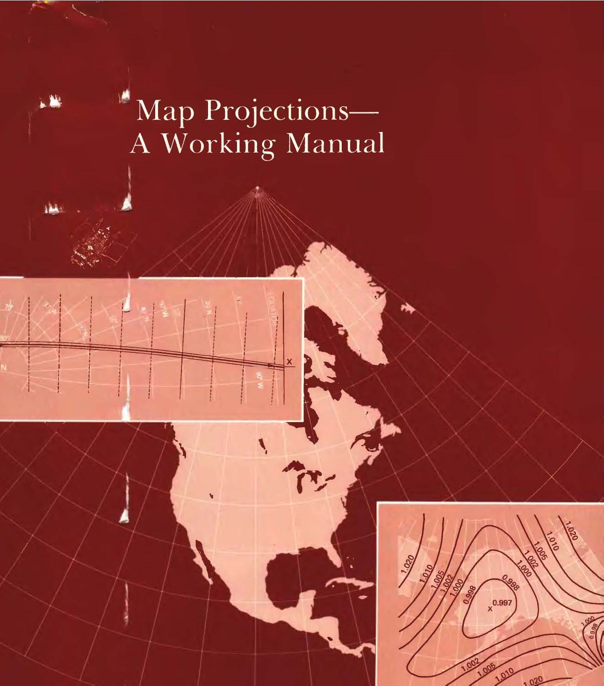

# Map Projections
The subject of map projections is fascinating. It is one of the first cases where high level mathematics had a profound impact on day to day life and, to this day, very few look at a map and fully understand the complexity hidden behind a deceptively simple object.

For anyone who gains some interest in the subject, a reference point is the publication of John P. Snyder, Map Projections - A Working Manual. To this day (it was published in 1987), it remains _the_ reference when searching for a map projection.

John Parr Snyder (1926-1997) was a chemical engineer working for CIBA-Geigy with a lifelong interest in maps and map projections. At the age of 50, in 1976, he attended a cartography conference and learned about the need for a new projection to be used with Landsat satellites data. He designed what become known as the [Space Oblique Mercator]() and offered it free to US Geological Survey (USGS). Two years later he was working in USGS and, in 1987, he published this compendium of map projections.   
<--->


Although the publication [can be found online](https://pubs.er.usgs.gov/publication/pp1395), it is a scan of the original book. The following pages try to be a true online version of the original. All formulas have be transcribed in TEX and rendered using [MathJax](https://www.mathjax.org/). The [numerical examples]() are implemented using JavaScript. The default values can be changed and all affected formulas will be recalculated. 

**I am not claiming any intellectual rights: this is a transcription in a new form of the original publication and it is done only as a tribute to a truly valuable work. All rights remain with the original copyright holders.** I am inclined to believe that, as a U.S. government work, the original publication is in public domain (see [this reference](https://www.copyrightlaws.com/copyright-laws-in-u-s-government-works/)). As such, this online manual would also be in public domain. However, I am no lawyer and may want to verify this information.

## Contents
- [Symbols and Acronyms]()
- [Introduction]()  
- [General Concepts]()  
  [1. Characteristics of Map Projections]()  
  [2. Latitude and Longitude]()  
  [3. The Datum and the Earth as an Ellipsoid]()  
  [4. Scale Variation and Angular Distortion]()  
  [5. Transformation of Map Graticules]()  
  [6. Classification and Selection of Map Projections]()  
   
- [Cylindrical Map Projections]()  
  [7. Mercator Projection]()  
  [8. Transverse Mercator Projection]()  
  [9. Oblique Mercator Projection]()  
  [10. Cylindrical Equal-Area Projection]()  
  [11. Miller Cylindrical Projection]()  
  [12. Equidistant Cylindrical Projection]()  
  [13. Cassini Projection]()  
   
- [Conic Map Projections]()  
  [14. Albers Equal-Area Conic Projection]()  
  [15. Lambert Conformal Conic Projection]()  
  [16. Equidistant Conic Projection]()  
  [17. Bipolar Oblique Conic Conformal Projection]()  
  [18. Polyconic Projection]()  
  [19. Bonne projection]()  

- [Azimuthal and Related Map Projections]()  
  [20. Orthographic Projection]()  
  [21. Stereographic Projection]()  
  [22. Gnomonic Projection]()  
  [23. General Perspective Projection]()  
  [24. Lambert Azimuthal Equal-Area Projection]()  
  [25. Azimuthal Equidistant Projection]()  
  [26. Modified-Stereographic Conformal Projections]()  

- [Space Map Projections]()  
  [27. Space Oblique Mercator Projection]()  
  [28. Satellite-Tracking projections]()  

- [Pseudocylindrical and Miscellaneous Map Projections]()  
  [29. Van der Grinten Projection]()  
  [30. Sinusoidal Projection]()  
  [31. Mollweide Projection]()  
  [32. Eckert IV and VI projections]()  

- [APENDIX A. Numerical Examples]()

## Further References
- NASA Landsat Science - [John Parr Snyder's Space Oblique Mercator Projection](https://landsat.gsfc.nasa.gov/article/john-parr-synders-space-oblique-mercator-projection/)
- Library of Congress Blogs - [From Childhood Fancy to Space Age Discovery](https://blogs.loc.gov/maps/2023/08/from-childhood-fancy-to-space-age-discovery/)
